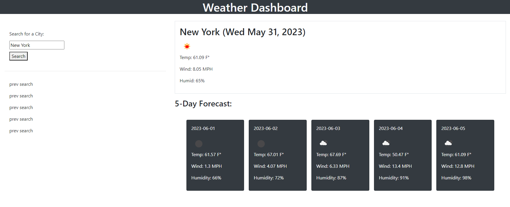

# Weather App

## Description

This webpage is a weather tracking app! It displays the current weather as well as the 5-day forecast.

### User Story

 AS A traveler
 I WANT to see the weather outlook for multiple cities
 SO THAT I can plan a trip accordingly

### Acceptance Criteria

 GIVEN a weather dashboard with form inputs
 WHEN I search for a city
 THEN I am presented with current and future conditions for that city and that city is added to the search history
 WHEN I view current weather conditions for that city
 THEN I am presented with the city name, the date, an icon representation of weather conditions, the temperature, the humidity, and the wind speed
 WHEN I view future weather conditions for that city
 THEN I am presented with a 5-day forecast that displays the date, an icon representation of weather conditions, the temperature, the wind speed, and the humidity
 WHEN I click on a city in the search history
 THEN I am again presented with current and future conditions for that city

## Installation

N/A It's a website!

## Usage

Start by entering the name of the city you'd like to see the weather for. Click the search button and view the current weather at the top of th page and the 5-day forecast underneath.

Link: https://github.com/DanielG808/weather-app/deployments

## Credits

Columbia Coding Bootcamp

And you for visiting my page!

## License

MIT License
